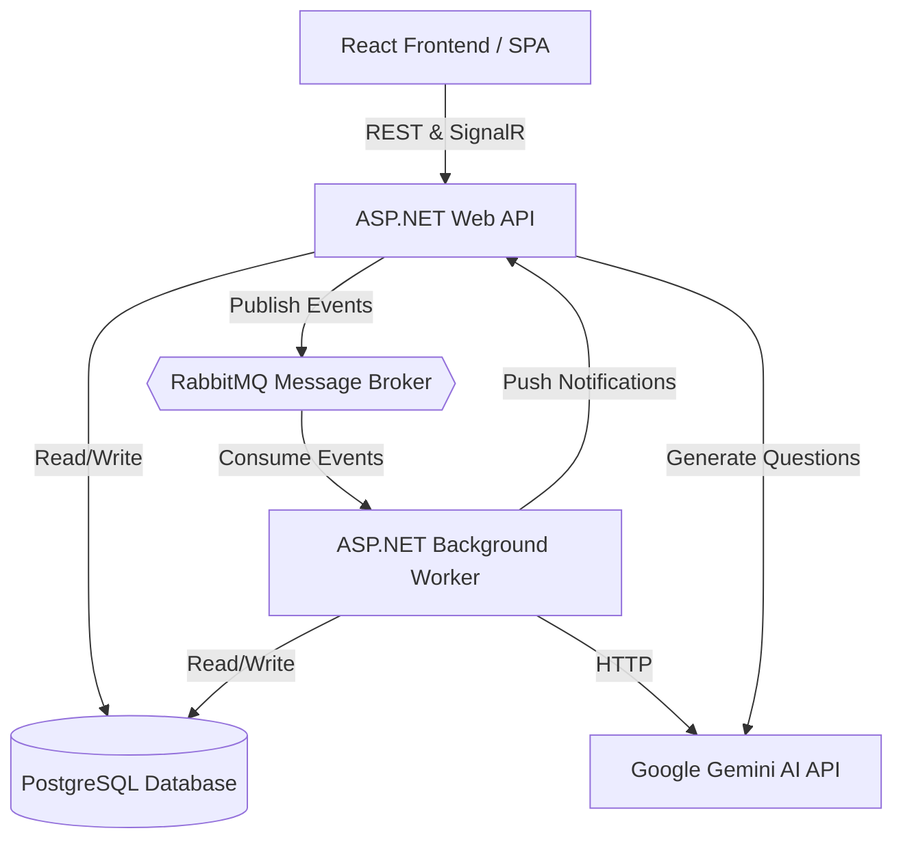

# InterviewAI 🚀

InterviewAI is a state-of-the-art AI-powered interview coaching application. It allows candidates to upload their resumes, engage in realistic simulated interview sessions tailored to their backgrounds, receive real-time coaching feedback, and track their preparation scores over time.

---

## 🌟 Key Features

- **Resume-Aware Prompts:** The AI parses candidate resumes (PDF/DOCX) to generate tailored engineering questions matching their exact tech stacks and experience.
- **Glassmorphic UI:** Modern dark-theme visual aesthetics with glowing card elements, micro-animations, hover elevations, and customized vector icons.
- **Interactive Chat Coach:** Realistic chat dialogue flow with a pulsing connection indicator, sticky glass inputs, and support for keydown triggers.
- **Simulated Typing Indicator:** AI interviewer exhibits a bouncing-dots thinking indicator (1.5s delay) to feel responsive and real.
- **Analytics & History Logs:** Progress dashboard compiling stats cards (e.g. average score, total sessions) and timeline indicators.
- **Secure Authentication:** JWT-based authentication system persisting secure sessions.

---

## 🏗️ Architecture Patterns

The application follows a modern decoupled architecture, combining **Clean Architecture** for the backend with an event-driven background processing model. 

### Core Patterns
- **Clean Architecture (Backend):** Separation of concerns via API, Application, Domain, and Infrastructure layers.
- **Event-Driven Processing:** High-latency tasks (like AI prompt generation and resume parsing) are pushed to a RabbitMQ message bus and picked up asynchronously by a .NET Background Worker service.
- **Real-Time Communication:** SignalR is used to push evaluation scores and feedback instantly back to the React frontend once the background worker completes processing.
- **Microservices Deployment:** The application is fully containerized into isolated services via Docker Compose.

### System Diagram



---

## 🐳 Try on your own device (Docker Setup)

You can easily spin up the entire application stack using Docker Compose. The environment includes the Frontend, Backend API, Worker, PostgreSQL database, and RabbitMQ broker.

### Prerequisites
- [Docker & Docker Compose](https://www.docker.com/)

### Steps

1. **Configure API Key:**
   Open the `.env` file in the root directory and add your Google Gemini API key:
   ```env
   GEMINI_API_KEY=your_gemini_api_key_here
   POSTGRES_PASSWORD=123
   ```

2. **Spin up the cluster:**
   Open your terminal in the root directory and run:
   ```bash
   docker compose up
   ```

3. **Access the Services:**
   - **Frontend App:** [http://localhost:5173](http://localhost:5173)
   - **Backend API (Swagger):** [http://localhost:7265/swagger](http://localhost:7265/swagger)
   - **RabbitMQ Dashboard:** [http://localhost:15672](http://localhost:15672) (Login: `guest` / `guest`)
   - **PostgreSQL Database:** `localhost:5432`

*Note: The ASP.NET API automatically runs Entity Framework migrations on startup, ensuring the PostgreSQL database is populated with the correct tables immediately.*

---

## 🛠️ Local Development (Manual Setup)

If you prefer to run the services manually outside of Docker:

### Client-Side Setup (React Frontend)
1. Navigate to the client directory: `cd client`
2. Install dependencies: `npm install`
3. Run the local dev server: `npm run dev`

### Server-Side Setup (.NET Backend)
Ensure you have a local PostgreSQL and RabbitMQ instance running.
1. Add your Gemini API key to .NET user secrets for both projects.
2. Navigate to the server folder: `cd server`
3. Run the Web API: `dotnet run --project API/Interview_API/Interview_API.csproj`
4. In a separate terminal, run the Worker: `dotnet run --project Workers/Workers.csproj`

---

## 🔒 Authentication System Details

The platform uses JWT authorization tokens issued by the C# backend. 
- Protected client routes (`/practice`, `/interview`, `/history`) check the session and automatically redirect unauthenticated traffic to `/login`.
- The `AuthContext.jsx` connects directly to `/api/auth/login` and saves the token to `localStorage`, securely injecting it into all `apiFetch` headers.

---

## 🛠️ Built With

- **Frontend:** React 19, Vite 7, Tailwind CSS v4, Wouter (Routing), TanStack React Query (State Management), SignalR Client.
- **Backend:** C# .NET 8, ASP.NET Core Web API, RabbitMQ, PostgreSQL, Entity Framework Core, Google Gemini AI.
